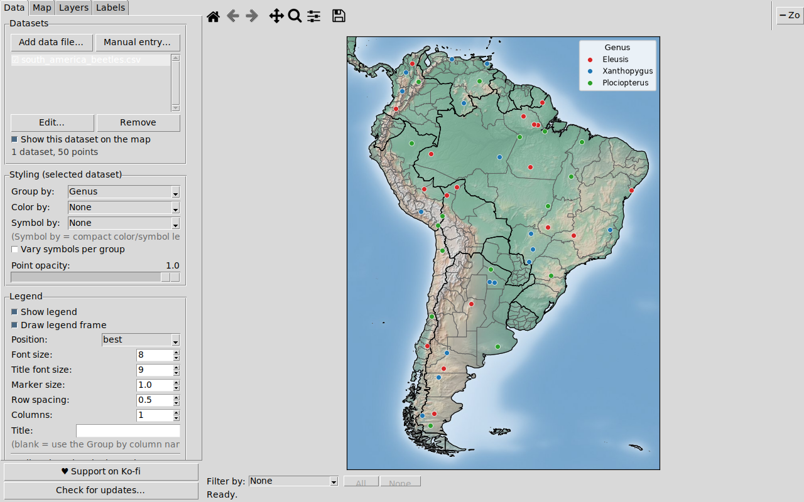
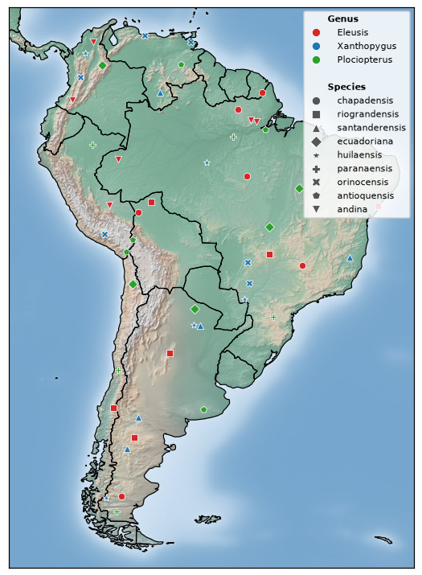
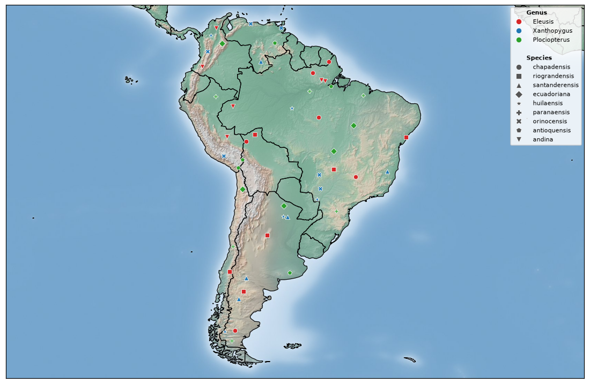
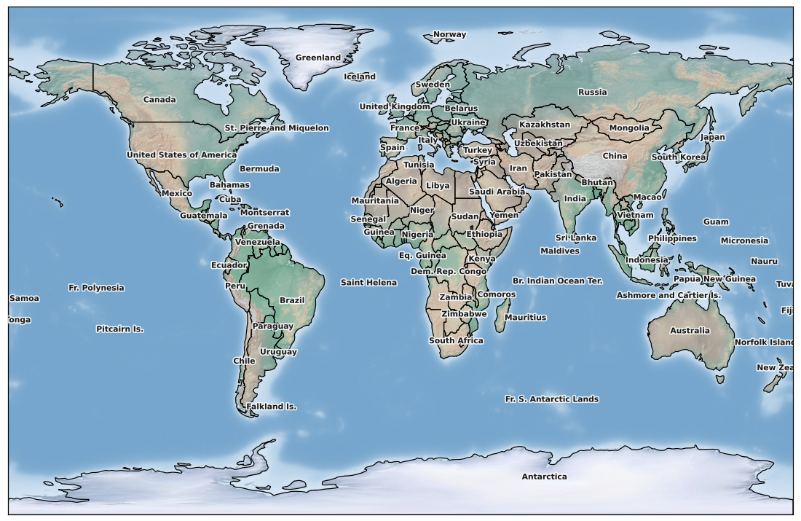
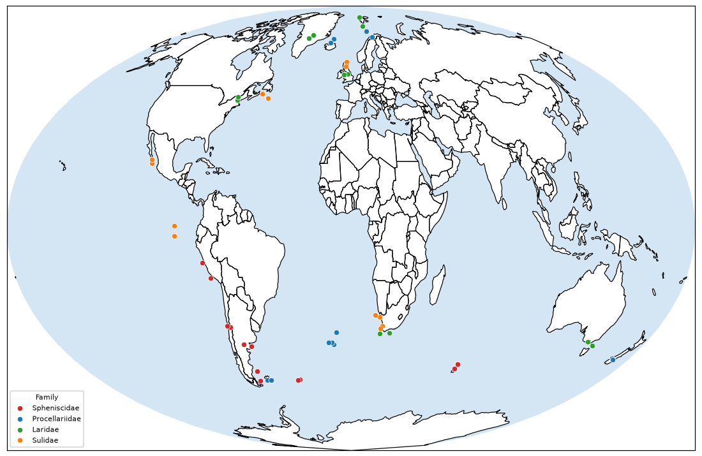
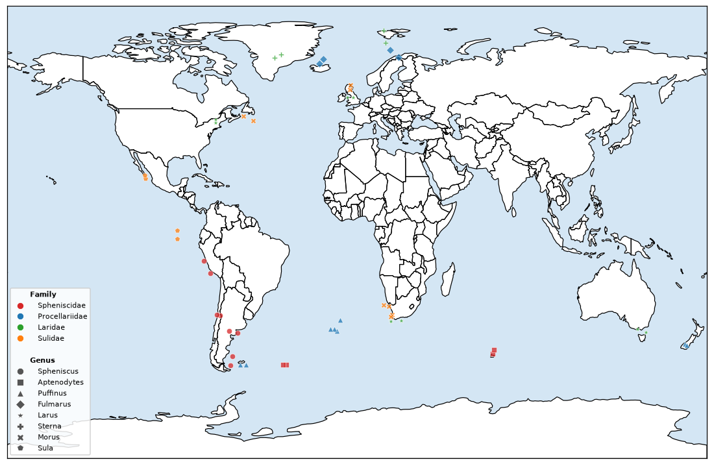
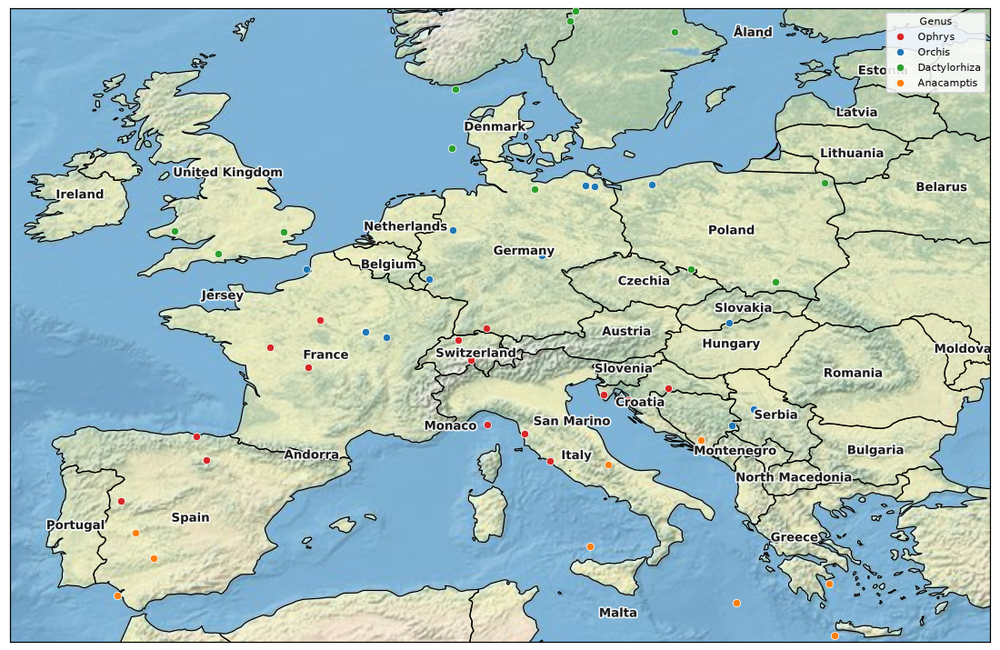

# PyMappr

Simple desktop mapping software focused on high-quality point-distribution
maps. Load point data from CSV/Excel files or type it in by hand, style it,
explore Natural Earth base layers in real time in several map projections,
save your work as a project, and export the result as a PNG - or as a
ready-to-run Python/R script that recreates the map outside PyMappr.

PyMappr is essentially a remake of
[SimpleMappr](https://www.simplemappr.net/) in Python: the same
"CSV of localities in, publication-ready point map out" workflow, but as an
offline desktop application.


[](https://doi.org/10.5281/zenodo.21522496)


## Features

- **Projects**: everything on the map - every dataset (data included),
  styling, layers, projection, and view - saves to a single `.pymappr`
  file. Create, name, save, load, rename, and delete projects from the
  File menu; projects live in a **user-selectable projects folder**
  (Documents/PyMappr Projects by default) and persist across application
  updates. **Export/Import project** shares a self-contained project file
  with collaborators. The current session also **autosaves on exit and is
  restored on the next launch**, so closing the app never loses work.
- **CSV, TSV, text, and Excel input** (`.csv`, `.tsv`, `.txt`, `.xlsx`,
  `.xlsm`) with a Longitude column, a Latitude column, and any number of
  name columns (e.g. `Country, State, County, City, Longitude, Latitude`).
  Any column order works; multi-sheet workbooks get a worksheet selector.
- **Column mapping on import**: when a file is opened you always choose
  which column is Latitude and which is Longitude, tick the columns to use
  as names, and pick whether the name labels use the file headers or the
  generic `Name 1, Name 2, Name 3, ...` numbering. The **first row is not
  assumed to be headers**: a checkbox controls whether it is column names
  or data to plot, and PyMappr pre-guesses from the file contents.
- **Manual entry**: type or paste points directly - one `lat, lon` line
  per point (optionally with a label), plus a legend name, marker shape,
  size, and color, like SimpleMappr's coordinate boxes. Manually entered
  datasets can be re-opened and edited later.
- **Multiple datasets on one map**: add as many files/manual point sets as
  you like - each keeps its own grouping and styling, can be shown/hidden
  independently, and they share the map and legend (handy for long-term
  projects).
- **Coordinates in decimal degrees or DMS**: `-97.7431`, `97°44'35"W`,
  `97 44 35 W`, `97d 44m 35s W`, `37°46.493'N`, and more.
- **Real-time map view** - pan, zoom, and toggle layers live. Zoom with the
  **scroll wheel** (about the cursor), the **Zoom in / Zoom out** buttons in
  the toolbar, `Ctrl+=` / `Ctrl+-`, or the toolbar's rubber-band zoom.
  Panning east or west **loops around the globe** seamlessly.
- **Map projections**: Equirectangular (default), Mercator, Robinson,
  Mollweide, Natural Earth, and Winkel Tripel, a **Globe (Orthographic)**
  view that shows the Earth as a disk seen from space, plus regional
  **Lambert** projections (North America, Europe, Asia, South America,
  Africa, and a custom Lambert Azimuthal). The Globe and the Lambert
  projections take a **customizable centre** - set the central meridian and
  latitude to spin the globe or re-centre the map on your region. Every
  layer, label, point, and the satellite basemap is reprojected live.
- **Landscape or portrait orientation**: switch the map between filling the
  canvas (*Landscape*) and a tall, centred frame (*Portrait*), so a tall
  region like South America fills the page instead of floating in a band of
  ocean. The framing stays correct as the window is resized or maximised, and
  a saved image is cropped to the chosen shape.
- **Basemaps**: *Simple* (white with black borders) or full-color offline
  rasters - *Relief* (Natural Earth I / II shaded relief), a *greyscale*
  relief, and *Blue Marble* (Natural Earth hypsometric tints) - reprojected
  live.
- **~30 Natural Earth layer toggles**, organized in a tabbed side panel:
  - *Borders & areas*: Countries, States/Provinces, US Counties,
    Sovereign states, Map units, Map subunits, Dependencies,
    Disputed areas, Disputed boundaries, Time zones
  - *Cities & places*: Populated places (city markers) with a
    **Capitals only** filter
  - *Water & marine*: Oceans (greyscale or blue), **Bathymetry** (stacked
    ocean-depth shading), Lakes (outlines), Lakes fill (greyscale or
    blue), Rivers, Wadis / intermittent rivers, Maritime boundaries,
    EEZ / 200 nm limits, Reefs
  - *Physical features*: Land polygons, Glaciers, Antarctic ice shelves,
    Playas, Deserts, Geographic regions
  - *Culture & infrastructure*: Urban areas, Airports, Ports,
    Parks & protected areas (US), Roads
  - *Biodiversity & ecoregions*: Biodiversity hotspots, Terrestrial
    ecoregions, Marine ecoregions - optional overlays from external open
    datasets, downloaded by `scripts/fetch_data.py` (ticking one before it
    is downloaded shows a note instead of failing)

  Switching Countries off removes the political borders but keeps the
  continent outlines.
- **Automatic scale-dependent detail**:
  - Core layers (countries, lakes, rivers, oceans, land) switch between
    the Natural Earth **110m / 50m / 10m** resolutions as you zoom, so the
    world view stays fast and close-ups stay crisp. Each resolution is
    built once and cached, so crossing a zoom threshold afterwards is
    instant.
  - City, airport, and port markers/labels **fade in as you zoom**,
    biggest first, using Natural Earth's curated per-place ranks.
- **Fast and responsive**: parsed layers are cached on disk (so later app
  starts load them near-instantly), reprojected layers are cached per
  projection, the most-used layers are pre-loaded in the background at
  startup, and wrap-around world copies share geometry instead of being
  rebuilt.
- **Compass** (north arrow) toggle.
- **Line thickness** control for all border/line layers.
- **Label toggles**: Countries, States/Provinces, US Counties, Major
  cities, Airports, Ports, Lakes, Rivers, Geographic regions, Time zones.
  Every country in view is labelled even fully zoomed out; every state and
  county in view is labelled once you zoom in to its level. Labels
  **never overlap** - when two would collide, the less important one is
  hidden until you zoom in - and any label can be **dragged with the mouse**
  to fine-tune its position (right-click a dragged label to snap it back).
- **Continent presets**: limit the view to Africa, Antarctica, Asia, Europe,
  North America, Oceania, South America, or the World.
- **Graticule** at 1°, 5°, or 10° with optional grid labels, drawn as
  projected curves in non-rectangular projections.
- **Customizable legend**:
  - per-group color, symbol, and size - symbols include circle, square,
    star, diamond, triangles, plus, X, pentagon, hexagon, octagon, and more,
    each in a **solid and an open (outline-only) version**
  - *Group by* any name column, and *Color by* another: group by Genus and
    color by Family, and every genus in a family shares that family's color
    while keeping its own shape
  - *Vary symbols per group* to cycle shapes automatically
  - position, label and title font size, legend marker size, row spacing,
    column count, frame on/off, and a custom title
  - **drag the whole legend** anywhere on (or off) the map, with no limits,
    once *Allow dragging the legend* is ticked - right-click it to snap back
    to the chosen position
- **Two-attribute styling for deep hierarchies**: *Color by* one column and
  *Symbol by* another to encode two levels at once (e.g. color by Family,
  symbol by Genus). The legend switches to a compact **color key + symbol
  key** - a handful of colors and shapes - instead of one row per
  combination, so a many-species dataset stays readable.
- **Point opacity** slider to keep dense, overlapping point clouds legible.
- **Filter bar below the map**: pick a name column and tick the values to
  show - on the world-seabirds dataset, filter by Family and untick a family
  to hide its colonies. *All*/*None* buttons for quick toggling.
  The legend follows the filter: only the values currently shown on the map
  appear in it (their colors and symbols stay stable while you toggle).
- **Save map as PNG** at 100-300 DPI.
- **Export as code**: turn the current map into a ready-to-run **Python
  (pandas + geopandas + matplotlib) or R (sf + ggplot2) script** and
  reproduce or adapt it in an IDE - it just works, with no setup.
  Selecting a language pastes pre-made function templates filled in with
  your map settings, generated locally and deterministically (no AI, no
  network at export time). The Python script **replicates PyMappr's own
  renderer** - the same view, figure geometry, layer resolutions, draw
  order, colors, satellite basemap, bathymetry, graticule with degree
  labels, map labels, compass, marker styling, and legend - so its
  output matches the map in the app pixel for pixel; the R script
  mirrors the same map as closely as sf + ggplot2 allow. Take it away
  two ways: a single **self-contained file** - point data embedded
  inline, and missing packages installed automatically on first run -
  that you can paste into PyCharm, RStudio, or VS Code and click Run; or
  a whole **working directory** (the script, your point data as CSV, a
  `requirements.txt` / `install.R`, a README, a `.gitignore`, and - for
  R - an RStudio `.Rproj`) to point an IDE straight at. Either way the
  script downloads its map data from Natural Earth and caches it next to
  itself. Reachable from *File > Export map as code* or the Map tab's
  Export section.
- **Update check**: at most once per day, on launch, PyMappr asks the GitHub
  releases API whether a newer version exists and offers to open the
  releases page (silent when offline). *Help > Check for updates* and the
  **Check for updates button** in the side panel run the same check on
  demand.

## Screenshots

### Landscape and portrait orientation

The same map, two orientations. In **Landscape** the map fills the canvas; in
**Portrait** it is reframed as a tall, centred page - the vertical span is
kept and the sides are cropped, so a tall region fills the frame instead of
floating in ocean. Switching orientation, resizing, or maximising the window
all keep the framing correct, and a saved image is cropped to the shape.

The app in Portrait mode, showing the South American beetle localities:



The same view rendered to an image, portrait and landscape:

| Portrait | Landscape |
|----------|-----------|
|  |  |

### Layers, projections, and detail

The Layers tab: bathymetry, land fill, glaciers, ice shelves, deserts, and
the compass on a world view:


The physical layers rendered headlessly - bathymetry (stacked ocean-depth
blues), glaciers, Antarctic ice shelves, deserts, playas, and reefs:


Cities, airports, and ports over Europe - markers and labels appear as you
zoom (biggest first), and the coastline has automatically switched to the
10m resolution:


Boundary detail: disputed areas and boundaries, maritime boundaries,
EEZ / 200 nm limits, and urban areas:


Time zones (labelled) with national capitals:


Every country labelled on the offline Blue Marble basemap:



The Robinson projection with a 10° graticule:


Countries layer off: political borders removed, continent outlines kept:


The column-mapping dialog shown on every import - latitude/longitude
selection is required, name columns are ticked on and off:


## CSV format

The expected layout - any number of name columns followed by coordinates
(order is flexible; you confirm the mapping on import):

| Genus       | Species       | Longitude   | Latitude    |
|-------------|---------------|-------------|-------------|
| Eleusis     | chapadensis   | -68.4349    | -12.3541    |
| Xanthopygus | orinocensis   | 67°33'37"W  | 10°18'29"N  |

Working examples in [`sample_data/`](sample_data):

- [`south_america_beetles.csv`](sample_data/south_america_beetles.csv) - 50
  rove-beetle localities across South America (Genus + Species), for the
  color/symbol legend and the landscape/portrait examples above
- [`world_seabirds.csv`](sample_data/world_seabirds.csv) - seabird colonies
  worldwide with a three-level Family + Genus + Species hierarchy, for
  grouped and two-attribute styling
- [`europe_orchids.csv`](sample_data/europe_orchids.csv) - European orchid
  records (Genus + Species), for a regional map with labels

## Test cases

### South American beetles (Color by + Symbol by, in portrait)

[`sample_data/south_america_beetles.csv`](sample_data/south_america_beetles.csv)
has 50 rove-beetle localities across South America. Name 1 is the Genus
(Eleusis, Xanthopygus, Plociopterus) and Name 2 the Species. Set *Color by*
to Genus and *Symbol by* to Species: color encodes the genus and shape the
species, and the legend collapses to a compact color key (3 colors) plus
symbol key that decodes every point. Because South America is tall, this is a
natural fit for **Portrait** orientation - the two renders are shown at the
top of the Screenshots section.

### World seabirds (Group by, and Color by + Symbol by)

[`sample_data/world_seabirds.csv`](sample_data/world_seabirds.csv) maps
seabird colonies worldwide with a `Family, Genus, Species` hierarchy - 4
families, 8 genera, 12 species. *Group by* Family gives one color per family
with its own legend row:



Grouping by Species alone would make a long legend. Instead set *Color by* to
Family and *Symbol by* to Genus: color encodes the family, shape the genus,
and the legend collapses to a compact color key plus symbol key. Turning the
point opacity down keeps overlapping colonies readable:



### European orchids (regional map with labels)

[`sample_data/europe_orchids.csv`](sample_data/europe_orchids.csv) has
European orchid records (Genus + Species). Limiting the view to Europe,
grouping by Genus, and turning on country labels over a shaded-relief basemap
makes a publication-ready regional distribution map:



To reproduce these renders: `python scripts/make_screenshots.py`
(writes to `docs/images/`); the app-window screenshots come from
`python scripts/make_app_screenshot.py` (needs a display, or `xvfb-run`).

## Installing

Grab the latest build for your platform from the
[releases page](../../releases). Releases are built automatically whenever a
pull request is merged; each release also carries `PyMappr-<version>-source.zip`
and `PyMappr-<version>-source.tar.gz` archives of the source code.

> You are free to redistribute PyMappr and its source code however you please.
> That said, the [Releases tab](../../releases) of this repository is the only
> official place to download this software - builds obtained anywhere else are
> unofficial and unsupported.

| Platform       | File                                     | Install |
|----------------|------------------------------------------|---------|
| Windows        | `PyMappr-Setup-<version>.exe`             | Run the installer (asks about a desktop shortcut). Re-running it offers to uninstall; there is also a Start-menu *Uninstall PyMappr* shortcut |
| macOS          | `PyMappr-<version>-macOS.dmg`             | Open the DMG and drag PyMappr to Applications |
| Linux (Ubuntu) | `pymappr_<version>_amd64.deb`             | `sudo apt install ./pymappr_<version>_amd64.deb`, then run `pymappr` |
| Linux (Fedora) | `pymappr-<version>-1.<dist>.x86_64.rpm`   | `sudo dnf install ./pymappr-<version>-*.x86_64.rpm`, then run `pymappr` |
| Linux (Arch)   | `pymappr-<version>-1-x86_64.pkg.tar.zst`  | `sudo pacman -U pymappr-<version>-1-x86_64.pkg.tar.zst`, then run `pymappr` |
| Any Linux      | `PyMappr-<version>-linux-<distro>-x86_64.tar.gz` | Extract and run `PyMappr/PyMappr` |

## Running from source

Requires Python 3.11+ with Tk support.

```bash
pip install -r requirements.txt
python scripts/fetch_data.py   # one-time data download (~165 MB core,
                               # + optional biodiversity/ecoregion overlays;
                               # add --skip-extras to fetch only the core)
python -m pymappr
```

## Building the packages

Automated: the
[`build-release.yml`](.github/workflows/build-release.yml) GitHub Actions
workflow builds the Windows installer, the macOS DMG, the Ubuntu `.deb` +
tarball, the Fedora `.rpm` + tarball, and the Arch `pkg.tar.zst` + tarball,
and attaches all of them - plus source `.zip`/`.tar.gz` archives - to a
GitHub release. It runs automatically when a pull request is merged into
`main` (and for `v*` tags or manual dispatch).

Locally:

- **Windows** (needs [Inno Setup 6](https://jrsoftware.org/isinfo.php) with
  `iscc` on PATH): `packaging\build_windows.bat`
- **macOS**: `pyinstaller packaging/pymappr.spec` then create a DMG from
  `dist/PyMappr.app`
- **Linux**: `pyinstaller packaging/pymappr.spec` then
  `packaging/build_linux.sh ubuntu --deb` (Debian/Ubuntu),
  `packaging/build_rpm.sh` (Fedora), or
  `cd packaging/arch && makepkg` (Arch)

## Development

```bash
python -m pytest tests/            # coordinate parser + CSV loader + styling tests
python scripts/render_preview.py   # headless render smoke test -> preview/*.png
python scripts/make_screenshots.py # regenerate the README images
```

Project layout:

- `pymappr/coords.py` - decimal/DMS coordinate parsing
- `pymappr/data_loader.py` - CSV/TSV/Excel reading, column mapping (N name
  columns), and manual coordinate entry parsing
- `pymappr/projects.py` - project files (`.pymappr`), the projects folder,
  settings, and the session autosave
- `pymappr/layers.py` - Natural Earth layer store: lazy loading, the
  110m/50m/10m resolution catalog, derived layers (continents, capitals,
  deserts, wadis, EEZ, bathymetry, ...), and the on-disk frame cache
- `pymappr/projections.py` - map projections (pyproj)
- `pymappr/renderer.py` - matplotlib map rendering (layers, labels, graticule,
  projections, wrap-around panning, zoom-dependent detail, legend, compass)
- `pymappr/styles.py` - point styles, marker symbols, group/color-by styling
- `pymappr/updates.py` - daily update check against the GitHub releases API
- `pymappr/app.py`, `pymappr/ui/` - Tkinter application (tabbed control
  panel, column mapper, manual entry, project manager, legend editor,
  filter bar)
- `scripts/fetch_data.py` - downloads and prepares the bundled map data
- `packaging/` - PyInstaller spec, Inno Setup script, Linux/Fedora/Arch
  packaging

## Support Me

If PyMappr is useful to you, you can support its development on Ko-fi:

[**ko-fi.com/calebhendren**](https://ko-fi.com/calebhendren)

There is also a *Support Me* section in the app's side panel and a
*Support me on Ko-fi* entry in the Help menu.

## Citation

Citing PyMappr is not necessary, but it is welcome. If PyMappr was useful in
your work - a map in a paper, a poster, a blog post, anything - you can
credit it like this:

> Hendren, Caleb. *PyMappr* [computer software].
> https://github.com/CalebHendren/PyMappr

## Data credits

Map data from [Natural Earth](https://www.naturalearthdata.com/) (public
domain): country/state/county boundaries, sovereignty/map unit/subunit
views, disputed areas and boundaries, maritime boundary and 200-nm-limit
indicators, time zones, populated places, urban areas, airports, ports,
US parks & protected lands, lakes, rivers (including intermittent
rivers/wadis), oceans, bathymetry, glaciers, Antarctic ice shelves, reefs,
playas, geographic regions, land polygons, roads, and the Natural Earth I
shaded-relief raster.

Two notes on the marine layers: Natural Earth ships EEZ *indicator lines*
(the "200 mi nl" maritime indicators shown by the *EEZ / 200 nm limits*
toggle), not full EEZ polygons; and the *Wadis* toggle draws Natural
Earth's intermittent rivers, its closest match for wadi/seasonal drainage.

The optional *Biodiversity & ecoregions* overlays come from external, openly
licensed datasets (the same datasets used by
[SimpleMappr](https://github.com/dshorthouse/SimpleMappr), in their
open-licensed forms), fetched by `scripts/fetch_data.py`:

- **Terrestrial ecoregions** - [RESOLVE Ecoregions 2017](https://ecoregions.appspot.com/)
  (Dinerstein et al. 2017), CC-BY 4.0.
- **Biodiversity hotspots** - [Conservation International Biodiversity
  Hotspots](https://zenodo.org/records/3261807) (version 2016.1), CC-BY.
- **Marine ecoregions** - [WWF/TNC Marine Ecoregions of the World
  (MEOW)](https://hub.arcgis.com/datasets/903c3ae05b264c00a3b5e58a4561b7e6),
  CC-BY 4.0.

These are optional: if a download source is unavailable, `fetch_data.py`
skips that layer and the rest of PyMappr works as usual.
