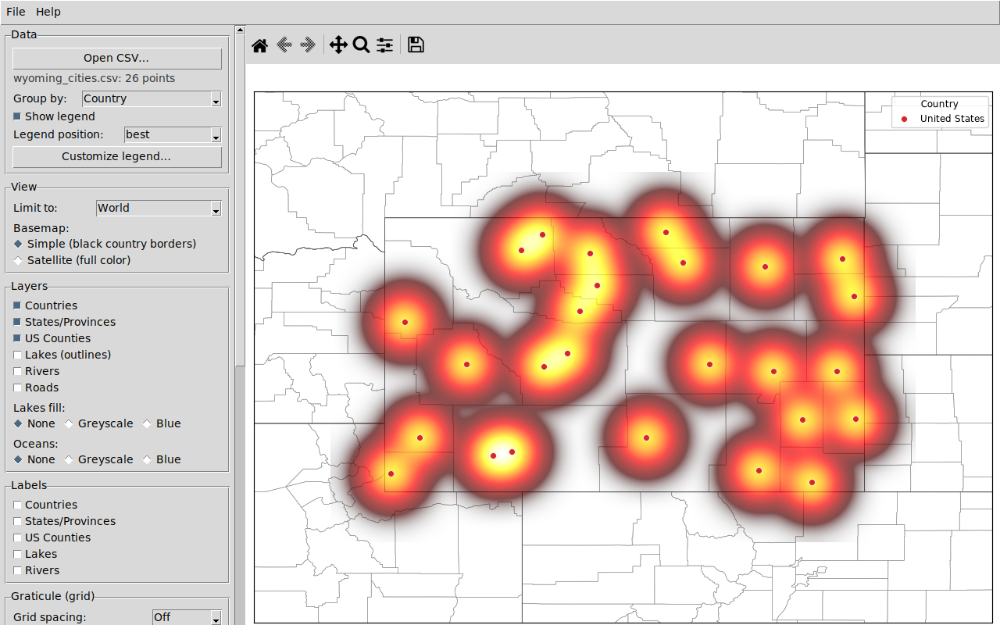
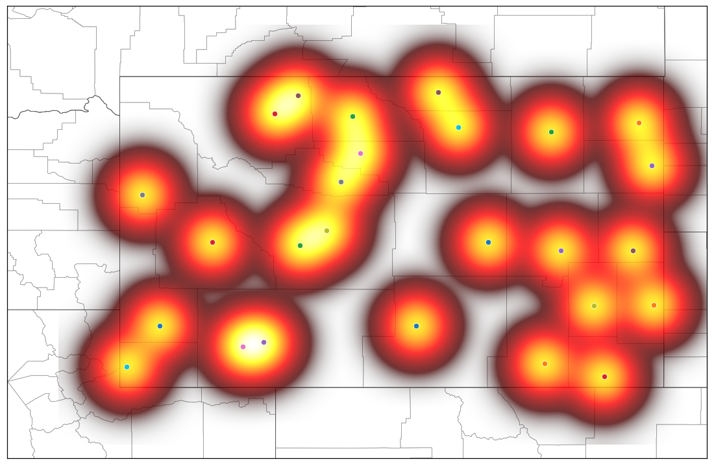
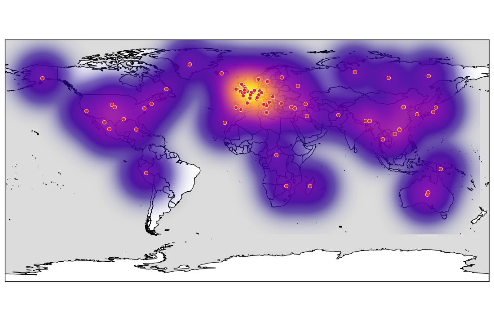
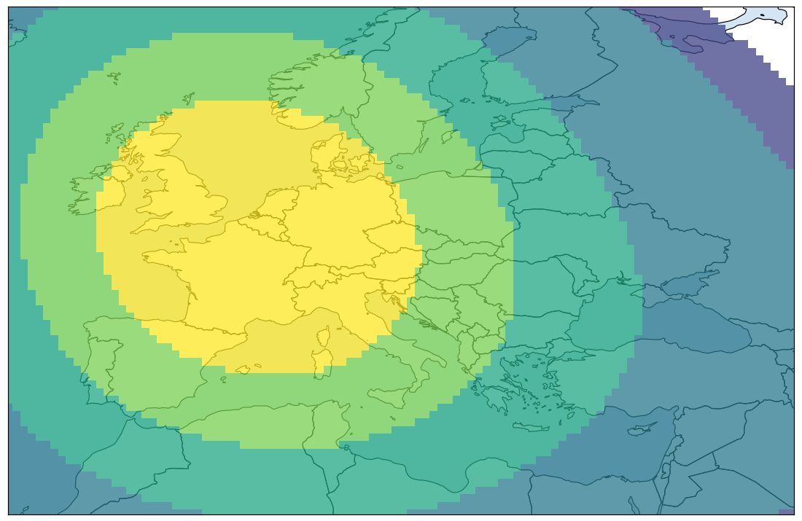

# EzMaps

Simple desktop mapping software. Load point data from a CSV, style it, explore
Natural Earth base layers in real time, build heatmaps, and export the result
as a PNG.


## Features

- **CSV input** with a Longitude column, a Latitude column, and any number of
  name columns (e.g. `Country, State, County, City, Longitude, Latitude`).
  Any column order works.
- **Column mapping on import**: when a CSV is opened you always choose which
  column is Latitude and which is Longitude, tick the columns to use as
  names, and pick whether the name labels use the CSV headers or the generic
  `Name 1, Name 2, Name 3, ...` numbering.
- **Coordinates in decimal degrees or DMS**: `-97.7431`, `97°44'35"W`,
  `97 44 35 W`, `97d 44m 35s W`, `37°46.493'N`, and more.
- **Real-time map view** - pan, zoom, and toggle layers live.
- **Basemaps**: *Simple* (white with black country borders) or *Satellite*
  (full-color Natural Earth shaded relief, fully offline).
- **Layer toggles**: Countries, States/Provinces, US Counties,
  Lakes (outlines), Lakes fill (greyscale or blue), Rivers,
  Oceans (greyscale or blue), Roads.
- **Label toggles**: Countries, States/Provinces, US Counties, Lakes, Rivers.
- **Continent presets**: limit the view to Africa, Antarctica, Asia, Europe,
  North America, Oceania, South America, or the World.
- **Graticule** at 1°, 5°, or 10° with optional grid labels.
- **Customizable legend**: per-group color, symbol (circle, square, triangle,
  diamond, star, ...), and size, grouped by any name column.
- **Heatmap** mode with full control over the render:
  - *Radius / bandwidth* - the area of influence of each point
  - *Blur / smoothing* - extra gaussian smoothing on top of the bandwidth
  - *Intensity / weight* - gamma curve that lifts faint areas or isolates
    hot spots
  - *Threshold* - clip densities below a fraction of the peak
  - *Classes* - continuous gradient or 3-9 discrete classification bands
  - *Color palette* - 20 gradients (hot, viridis, plasma, turbo, ...)
  - *Bloom* - a soft outer glow under the heatmap
  - *Opacity* - overall transparency
  - plus an option to draw the raw data points on top
- **Save map as PNG** at 100-300 DPI.

## Screenshots

Heatmap mode with the full set of render controls:



The column-mapping dialog shown on every import - latitude/longitude
selection is required, name columns are ticked on and off:


The offline satellite basemap with country labels:


US cities grouped and styled per group:


## CSV format

The expected layout - any number of name columns followed by coordinates
(order is flexible; you confirm the mapping on import):

| Country       | State   | County  | City     | Longitude   | Latitude   |
|---------------|---------|---------|----------|-------------|------------|
| United States | Wyoming | Laramie | Cheyenne | -104.8202   | 41.1400    |
| United States | Wyoming | Natrona | Casper   | 106°18'47"W | 42°52'00"N |

Working examples in [`sample_data/`](sample_data):

- [`us_cities.csv`](sample_data/us_cities.csv) - two name columns, mixed
  decimal and DMS notation
- [`wyoming_cities.csv`](sample_data/wyoming_cities.csv) - four name columns
  (Country, State, County, City)
- [`dog_breeds.csv`](sample_data/dog_breeds.csv) - Species + Breed with the
  place of origin of ~90 dog breeds

## Test cases

### Wyoming cities heatmap (four name columns)

[`sample_data/wyoming_cities.csv`](sample_data/wyoming_cities.csv) lists the
largest town in every Wyoming county as
`United States, Wyoming, <county>, <city>` - Name 1 is the country, Name 2
the state, Name 3 the county, and Name 4 the city (Cheyenne, Casper,
Gillette, Laramie, ...). Grouping by the County column labels every group in
the legend:


The same data as a heatmap (radius 18, blur 4, intensity 1.6, points on
top):



### Dog breed diversity heatmap (a real-world use case)

[`sample_data/dog_breeds.csv`](sample_data/dog_breeds.csv) maps ~90
`Canis lupus` breeds (wolf, poodle, greyhound, dingo, ...) to their place of
origin. Rendering it as a heatmap shows where dog diversity concentrates -
the European breed cluster dominates (plasma palette, intensity 1.8, bloom
enabled, points on top):



The same dataset zoomed to Europe with a 5-class classified heatmap and a
15% threshold (viridis palette):



To reproduce these renders: `python scripts/make_screenshots.py`
(writes to `docs/images/`).

## Installing

Grab the latest build for your platform from the
[releases page](../../releases). Releases are built automatically whenever a
pull request is merged.

| Platform       | File                                     | Install |
|----------------|------------------------------------------|---------|
| Windows        | `EzMaps-Setup-<version>.exe`             | Run the installer (asks about a desktop shortcut) |
| macOS          | `EzMaps-<version>-macOS.dmg`             | Open the DMG and drag EzMaps to Applications |
| Linux (Ubuntu) | `ezmaps_<version>_amd64.deb`             | `sudo apt install ./ezmaps_<version>_amd64.deb`, then run `ezmaps` |
| Linux (Arch)   | `ezmaps-<version>-1-x86_64.pkg.tar.zst`  | `sudo pacman -U ezmaps-<version>-1-x86_64.pkg.tar.zst`, then run `ezmaps` |
| Any Linux      | `EzMaps-<version>-linux-<distro>-x86_64.tar.gz` | Extract and run `EzMaps/EzMaps` |

## Running from source

Requires Python 3.11+ with Tk support.

```bash
pip install -r requirements.txt
python scripts/fetch_data.py   # one-time download of Natural Earth data (~130 MB)
python -m ezmaps
```

## Building the packages

Automated: the
[`build-release.yml`](.github/workflows/build-release.yml) GitHub Actions
workflow builds the Windows installer, the macOS DMG, the Ubuntu `.deb` +
tarball, and the Arch `pkg.tar.zst` + tarball, and attaches all of them to a
GitHub release. It runs automatically when a pull request is merged into
`main` (and for `v*` tags or manual dispatch).

Locally:

- **Windows** (needs [Inno Setup 6](https://jrsoftware.org/isinfo.php) with
  `iscc` on PATH): `packaging\build_windows.bat`
- **macOS**: `pyinstaller packaging/ezmaps.spec` then create a DMG from
  `dist/EzMaps.app`
- **Linux**: `pyinstaller packaging/ezmaps.spec` then
  `packaging/build_linux.sh ubuntu --deb` (Debian/Ubuntu) or
  `cd packaging/arch && makepkg` (Arch)

## Development

```bash
python -m pytest tests/            # coordinate parser + CSV loader + heatmap tests
python scripts/render_preview.py   # headless render smoke test -> preview/*.png
python scripts/make_screenshots.py # regenerate the README images
```

Project layout:

- `ezmaps/coords.py` - decimal/DMS coordinate parsing
- `ezmaps/data_loader.py` - CSV reading and column mapping (N name columns)
- `ezmaps/heatmap.py` - density grid: bandwidth, blur, intensity,
  threshold, classification
- `ezmaps/layers.py` - Natural Earth layer store (lazy loading)
- `ezmaps/renderer.py` - matplotlib map rendering (layers, labels, graticule,
  heatmap + bloom, legend)
- `ezmaps/app.py`, `ezmaps/ui/` - Tkinter application
- `scripts/fetch_data.py` - downloads and prepares the bundled map data
- `packaging/` - PyInstaller spec, Inno Setup script, Linux/Arch packaging

## Support Me

If EzMaps is useful to you, you can support its development on Patreon:

[**patreon.com/cw/CalebHendren**](https://www.patreon.com/cw/CalebHendren)

There is also a *Support Me* section in the app's side panel and a
*Support me on Patreon* entry in the Help menu.

## Citation

Citing EzMaps is not necessary, but it is welcome. If EzMaps was useful in
your work - a map in a paper, a poster, a blog post, anything - you can
credit it like this:

> Hendren, Caleb. *EzMaps* [computer software].
> https://github.com/CalebHendren/EzMaps

## Data credits

Map data from [Natural Earth](https://www.naturalearthdata.com/) (public
domain): country/state/county boundaries, lakes, rivers, oceans, roads, and
the Natural Earth I shaded-relief raster.
