# PyMappr

Simple desktop mapping software focused on high-quality point-distribution
maps. Load point data from CSV/Excel files or type it in by hand, style it,
explore Natural Earth base layers in real time in several map projections,
save your work as a project, and export the result as a PNG - or as a
ready-to-run Python/R script that recreates the map outside PyMappr.

PyMappr is essentially a remake of
[SimpleMappr](https://www.simplemappr.net/) in Python: the same
"CSV of localities in, publication-ready point map out" workflow, but as an
offline desktop application.


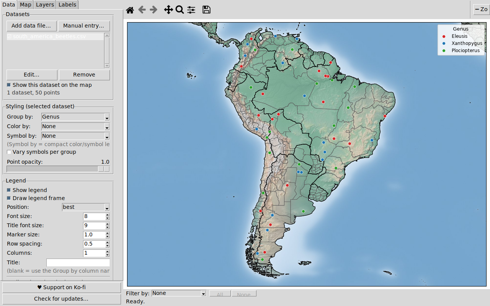

## Features

- **Projects**: everything on the map - every dataset (data included),
  styling, layers, projection, and view - saves to a single `.pymappr`
  file. Create, name, save, load, rename, and delete projects from the
  File menu; projects live in a **user-selectable projects folder**
  (Documents/PyMappr Projects by default) and persist across application
  updates. **Export/Import project** shares a self-contained project file
  with collaborators. The current session also **autosaves on exit and is
  restored on the next launch**, so closing the app never loses work.
- **CSV, TSV, text, and Excel input** (`.csv`, `.tsv`, `.txt`, `.xlsx`,
  `.xlsm`) with a Longitude column, a Latitude column, and any number of
  name columns (e.g. `Country, State, County, City, Longitude, Latitude`).
  Any column order works; multi-sheet workbooks get a worksheet selector.
- **Column mapping on import**: when a file is opened you always choose
  which column is Latitude and which is Longitude, tick the columns to use
  as names, and pick whether the name labels use the file headers or the
  generic `Name 1, Name 2, Name 3, ...` numbering. The **first row is not
  assumed to be headers**: a checkbox controls whether it is column names
  or data to plot, and PyMappr pre-guesses from the file contents.
- **Manual entry**: type or paste points directly - one `lat, lon` line
  per point (optionally with a label), plus a legend name, marker shape,
  size, and color, like SimpleMappr's coordinate boxes. Manually entered
  datasets can be re-opened and edited later.
- **Multiple datasets on one map**: add as many files/manual point sets as
  you like - each keeps its own grouping and styling, can be shown/hidden
  independently, and they share the map and legend (handy for long-term
  projects).
- **Coordinates in decimal degrees or DMS**: `-97.7431`, `97°44'35"W`,
  `97 44 35 W`, `97d 44m 35s W`, `37°46.493'N`, and more.
- **Real-time map view** - pan, zoom, and toggle layers live. Zoom with the
  **scroll wheel** (about the cursor), the **Zoom in / Zoom out** buttons in
  the toolbar, `Ctrl+=` / `Ctrl+-`, or the toolbar's rubber-band zoom.
  Panning east or west **loops around the globe** seamlessly.
- **Map projections**: Equirectangular (default), Mercator, Robinson,
  Mollweide, Natural Earth, and Winkel Tripel, plus regional **Lambert**
  projections (North America, Europe, Asia, South America, Africa, and a
  custom Lambert Azimuthal) with a **customizable point of natural origin** -
  set the central meridian and latitude of origin to re-centre the map on
  your region. Every layer, label, point, and the satellite basemap is
  reprojected live.
- **Basemaps**: *Simple* (white with black borders) or *Satellite*
  (full color, slower - Natural Earth shaded relief, fully offline).
- **~30 Natural Earth layer toggles**, organized in a tabbed side panel:
  - *Borders & areas*: Countries, States/Provinces, US Counties,
    Sovereign states, Map units, Map subunits, Dependencies,
    Disputed areas, Disputed boundaries, Time zones
  - *Cities & places*: Populated places (city markers) with a
    **Capitals only** filter
  - *Water & marine*: Oceans (greyscale or blue), **Bathymetry** (stacked
    ocean-depth shading), Lakes (outlines), Lakes fill (greyscale or
    blue), Rivers, Wadis / intermittent rivers, Maritime boundaries,
    EEZ / 200 nm limits, Reefs
  - *Physical features*: Land polygons, Glaciers, Antarctic ice shelves,
    Playas, Deserts, Geographic regions
  - *Culture & infrastructure*: Urban areas, Airports, Ports,
    Parks & protected areas (US), Roads
  - *Biodiversity & ecoregions*: Biodiversity hotspots, Terrestrial
    ecoregions, Marine ecoregions - optional overlays from external open
    datasets, downloaded by `scripts/fetch_data.py` (ticking one before it
    is downloaded shows a note instead of failing)

  Switching Countries off removes the political borders but keeps the
  continent outlines.
- **Automatic scale-dependent detail**:
  - Core layers (countries, lakes, rivers, oceans, land) switch between
    the Natural Earth **110m / 50m / 10m** resolutions as you zoom, so the
    world view stays fast and close-ups stay crisp. Each resolution is
    built once and cached, so crossing a zoom threshold afterwards is
    instant.
  - City, airport, and port markers/labels **fade in as you zoom**,
    biggest first, using Natural Earth's curated per-place ranks.
- **Fast and responsive**: parsed layers are cached on disk (so later app
  starts load them near-instantly), reprojected layers are cached per
  projection, the most-used layers are pre-loaded in the background at
  startup, and wrap-around world copies share geometry instead of being
  rebuilt.
- **Compass** (north arrow) toggle.
- **Line thickness** control for all border/line layers.
- **Label toggles**: Countries, States/Provinces, US Counties, Major
  cities, Airports, Ports, Lakes, Rivers, Geographic regions, Time zones.
  Every country in view is labelled even fully zoomed out; every state and
  county in view is labelled once you zoom in to its level. Labels
  **never overlap** - when two would collide, the less important one is
  hidden until you zoom in - and any label can be **dragged with the mouse**
  to fine-tune its position (right-click a dragged label to snap it back).
- **Continent presets**: limit the view to Africa, Antarctica, Asia, Europe,
  North America, Oceania, South America, or the World.
- **Graticule** at 1°, 5°, or 10° with optional grid labels, drawn as
  projected curves in non-rectangular projections.
- **Customizable legend**:
  - per-group color, symbol, and size - symbols include circle, square,
    star, diamond, triangles, plus, X, pentagon, hexagon, octagon, and more,
    each in a **solid and an open (outline-only) version**
  - *Group by* any name column, and *Color by* another: group by Animal and
    color by Family, and every feline species gets its own shape in one
    color while canines get their own shapes in another color
  - *Vary symbols per group* to cycle shapes automatically
  - position, font size, column count, frame on/off, and a custom title
- **Two-attribute styling for deep hierarchies**: *Color by* one column and
  *Symbol by* another to encode two levels at once (e.g. color by Order,
  symbol by Family). The legend switches to a compact **color key + symbol
  key** - a handful of colors and shapes - instead of one row per
  combination, so a 1500-point, 33-species dataset stays readable.
- **Point opacity** slider to keep dense, overlapping point clouds legible.
- **Filter bar below the map**: pick a name column and tick the values to
  show - on the felines-and-canines dataset, filter by Family and untick
  Felines to see only the dogs. *All*/*None* buttons for quick toggling.
  The legend follows the filter: only the values currently shown on the map
  appear in it (their colors and symbols stay stable while you toggle).
- **Save map as PNG** at 100-300 DPI.
- **Export as code**: turn the current map into a ready-to-run **Python
  (pandas + geopandas + matplotlib) or R (sf + ggplot2) script** to
  reproduce and adapt it in an IDE. Selecting a language pastes pre-made
  function templates filled in with your map settings - generated
  locally and deterministically, no AI and no network involved. The
  script downloads its base layers from Natural Earth, loads your point
  data from the original file (manually entered points are embedded
  inline), and recreates the projection, extent, layers, styling, and
  legend. Reachable from *File > Export map as code* or the Map tab's
  Export section.
- **Update check**: at most once per day, on launch, PyMappr asks the GitHub
  releases API whether a newer version exists and offers to open the
  releases page (silent when offline). *Help > Check for updates* and the
  **Check for updates button** in the side panel run the same check on
  demand.

## Screenshots

The Layers tab: bathymetry, land fill, glaciers, ice shelves, deserts, and
the compass on a world view:

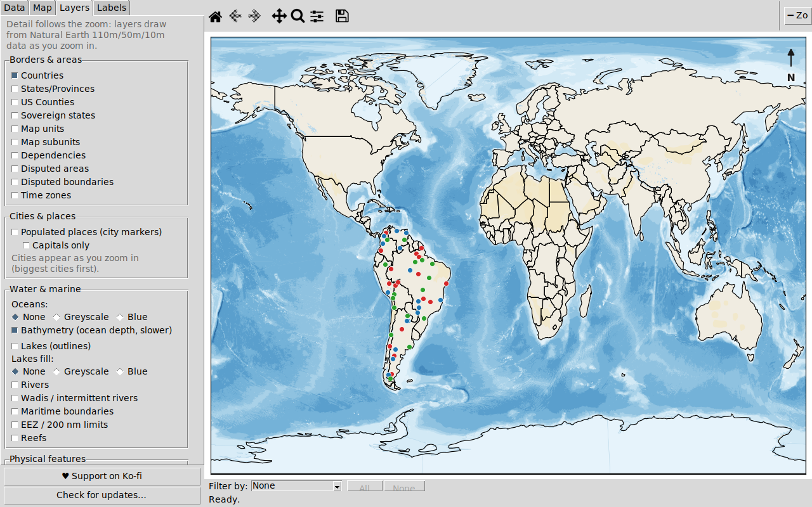

The physical layers rendered headlessly - bathymetry (stacked ocean-depth
blues), glaciers, Antarctic ice shelves, deserts, playas, and reefs:

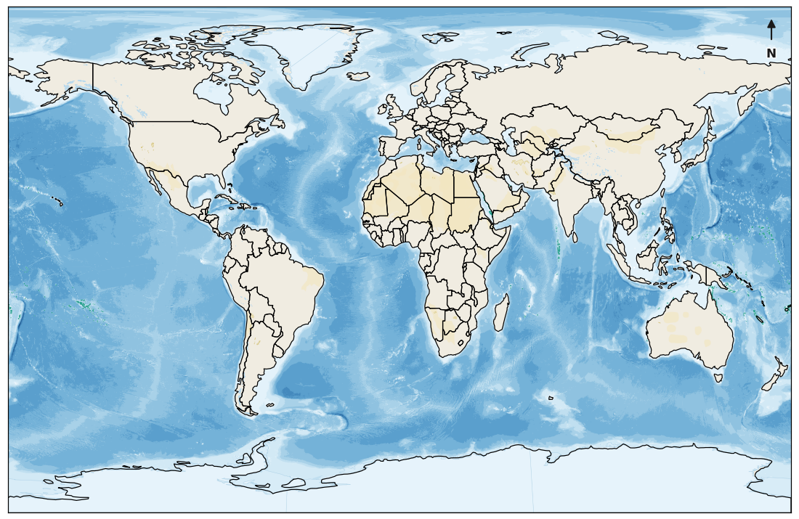

Cities, airports, and ports over Europe - markers and labels appear as you
zoom (biggest first), and the coastline has automatically switched to the
10m resolution:

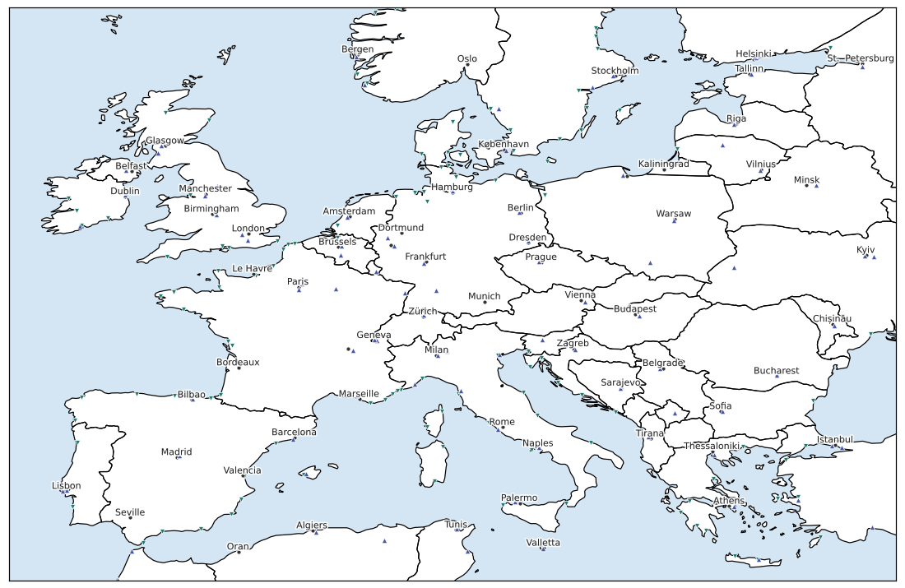

Boundary detail: disputed areas and boundaries, maritime boundaries,
EEZ / 200 nm limits, and urban areas:

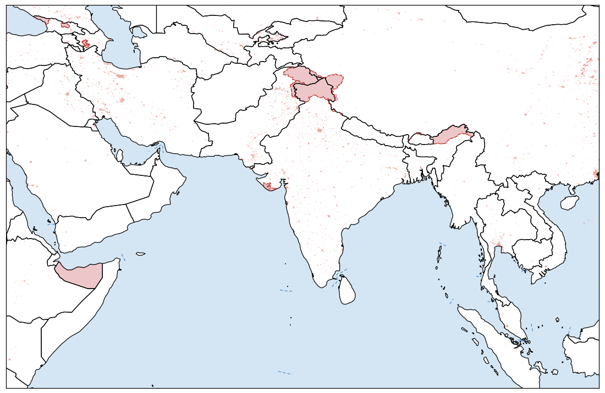

Time zones (labelled) with national capitals:

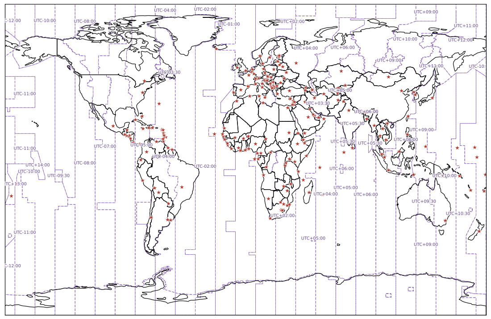

Every country labelled on the offline satellite basemap:

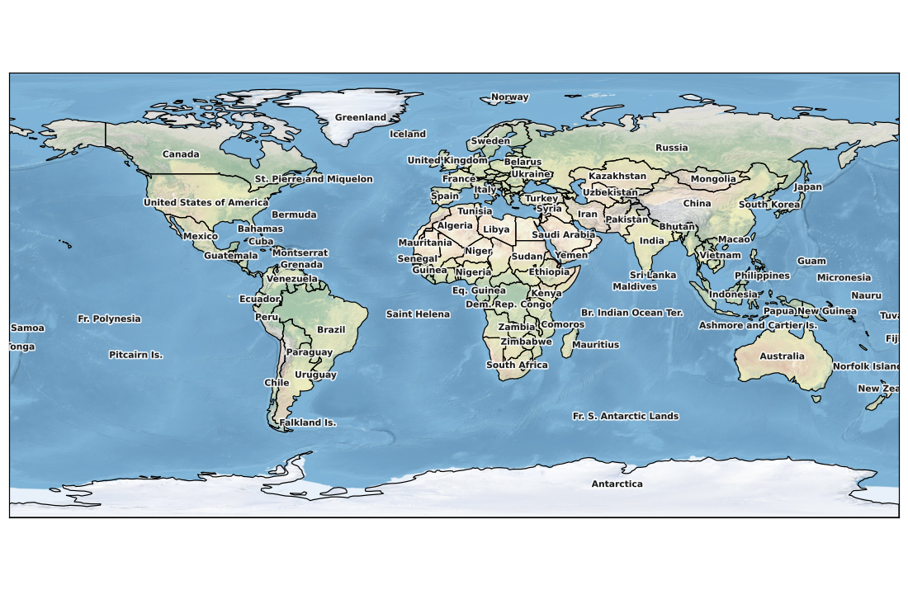

The Robinson projection with a 10° graticule:

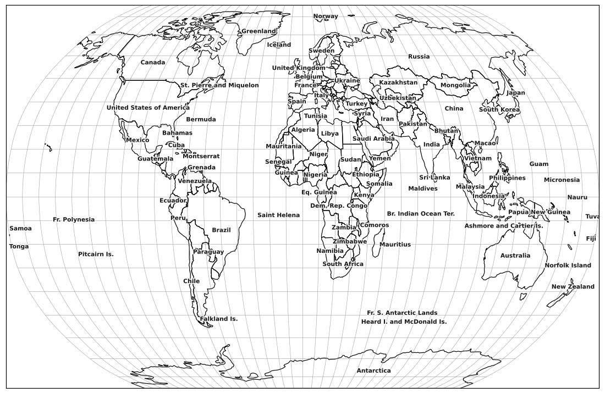

Countries layer off: political borders removed, continent outlines kept:

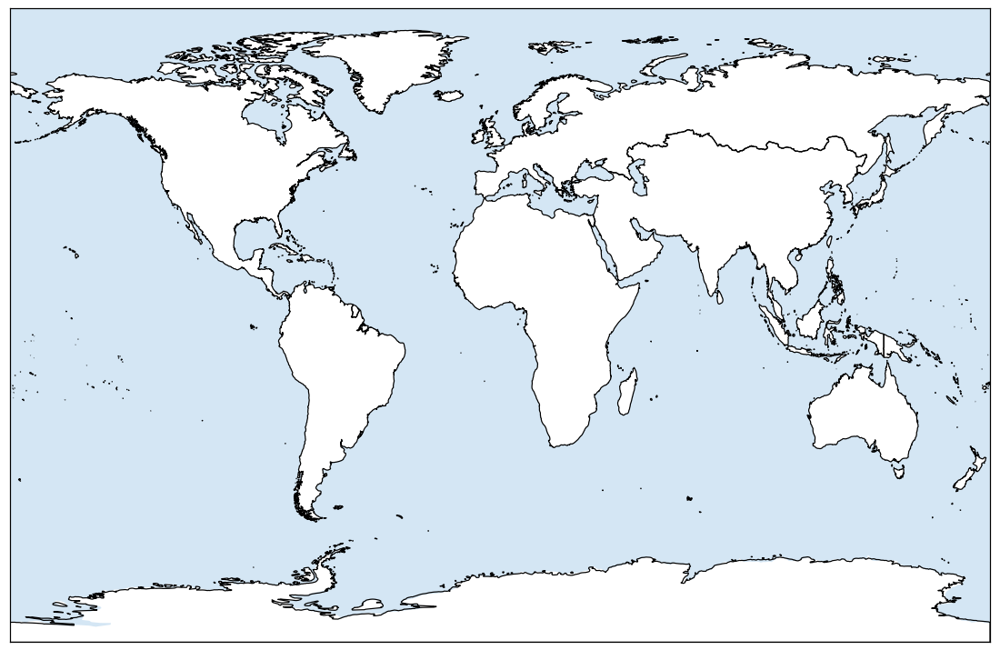

The column-mapping dialog shown on every import - latitude/longitude
selection is required, name columns are ticked on and off:

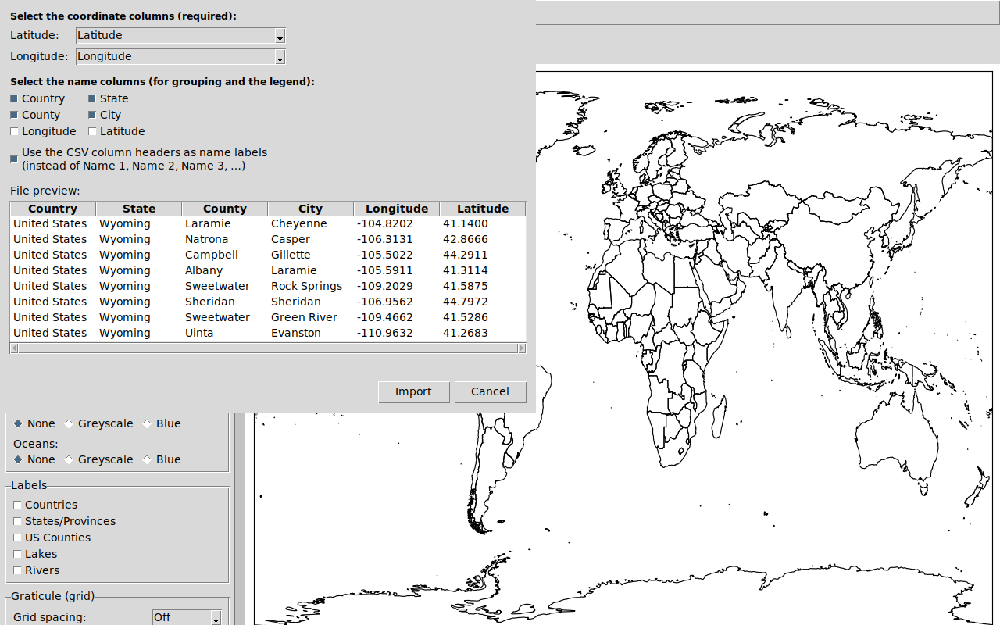

US cities grouped and styled per group:

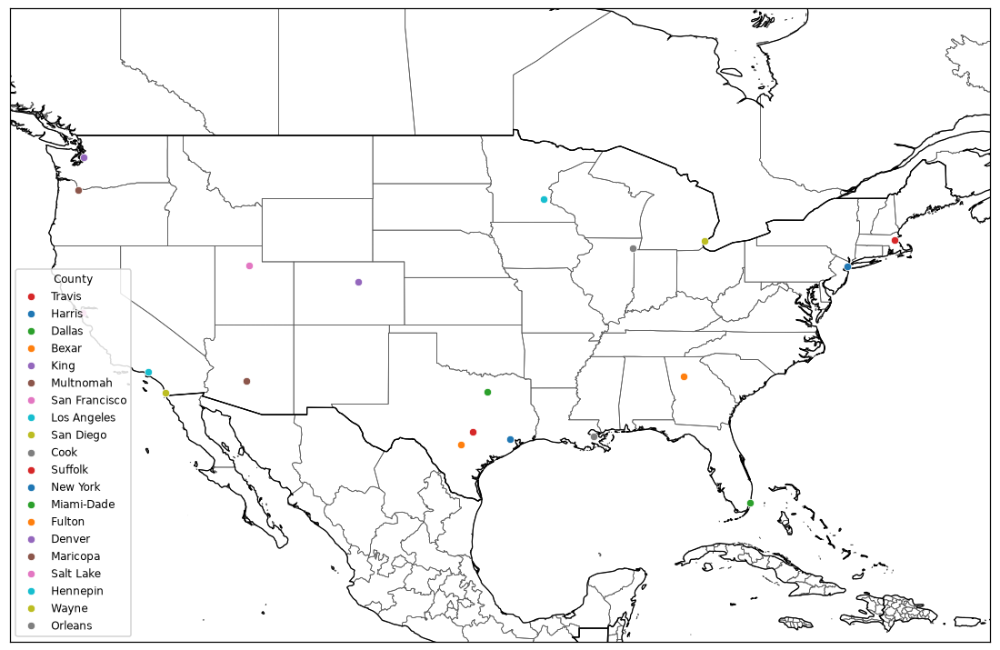

## CSV format

The expected layout - any number of name columns followed by coordinates
(order is flexible; you confirm the mapping on import):

| Country       | State   | County  | City     | Longitude   | Latitude   |
|---------------|---------|---------|----------|-------------|------------|
| United States | Wyoming | Laramie | Cheyenne | -104.8202   | 41.1400    |
| United States | Wyoming | Natrona | Casper   | 106°18'47"W | 42°52'00"N |

Working examples in [`sample_data/`](sample_data):

- [`us_cities.csv`](sample_data/us_cities.csv) - two name columns, mixed
  decimal and DMS notation
- [`wyoming_cities.csv`](sample_data/wyoming_cities.csv) - four name columns
  (Country, State, County, City)
- [`felines_and_canines.csv`](sample_data/felines_and_canines.csv) - Family +
  Animal + Place, for the grouped-styling test case below
- [`dog_breeds.csv`](sample_data/dog_breeds.csv) - Species + Breed with the
  place of origin of ~90 dog breeds
- [`insects.csv`](sample_data/insects.csv) - 1500 rows of a four-level
  taxonomy (Order, Family, Genus, Species) for the two-attribute styling
  test case below

## Test cases

### Wyoming cities by county (four name columns)

[`sample_data/wyoming_cities.csv`](sample_data/wyoming_cities.csv) lists the
largest town in every Wyoming county as
`United States, Wyoming, <county>, <city>` - Name 1 is the country, Name 2
the state, Name 3 the county, and Name 4 the city (Cheyenne, Casper,
Gillette, Laramie, ...). Grouping by the County column labels every group in
the legend, and the County labels layer names every county in view:

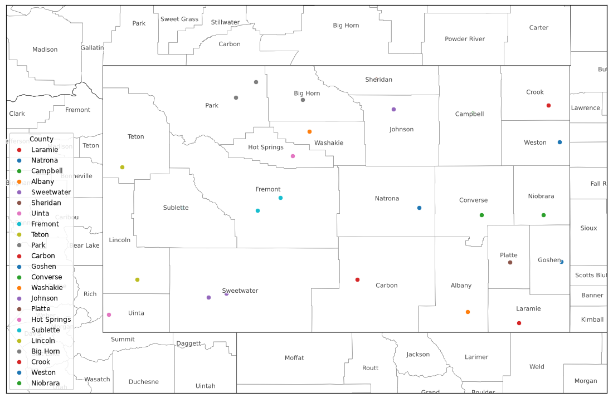

### Felines and canines (Group by + Color by)

[`sample_data/felines_and_canines.csv`](sample_data/felines_and_canines.csv)
maps sightings/ranges of cat and dog species. Name 1 is the Family (Felines
or Canines) and Name 2 the Animal. Set *Group by* to Animal and *Color by*
to Family: domestic cats, lions, cheetahs, and tigers each get their own
shape in the feline color, while wolves, coyotes, and dingoes get their own
shapes in the canine color:

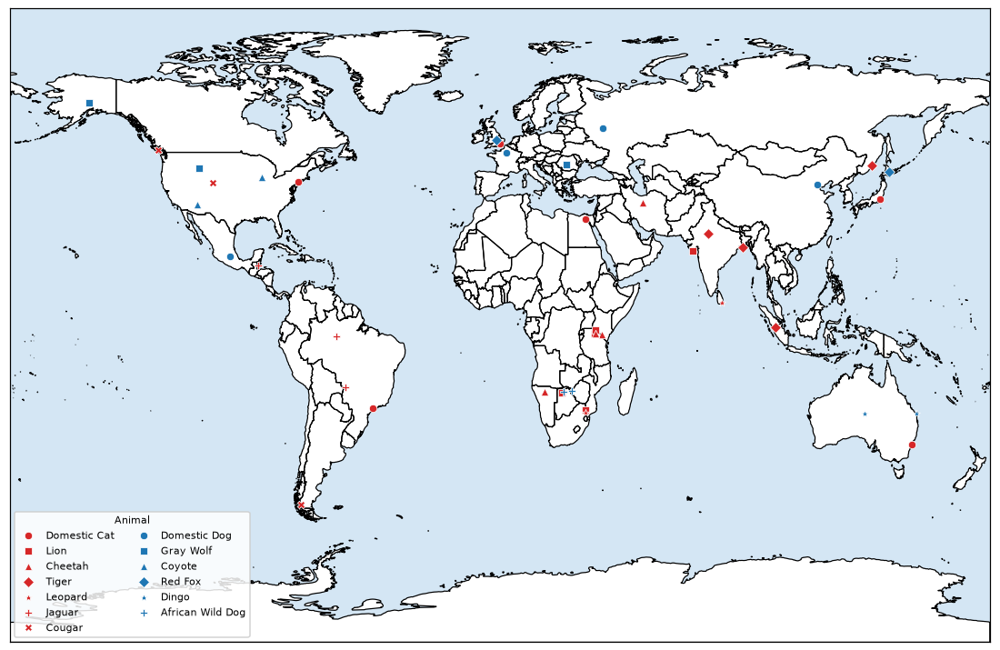

### Insects: a four-level taxonomy (Color by + Symbol by)

[`sample_data/insects.csv`](sample_data/insects.csv) has 1500 records with
an `Order, Family, Genus, Species` hierarchy - 3 orders, 7 families, 17
genera, 33 species. Grouping by Species alone would make a 33-row legend.
Instead, set *Color by* to Order and *Symbol by* to Family: color encodes
the order, shape encodes the family, and the legend collapses to a compact
color key (3 colors) plus symbol key (7 shapes) that decodes every point.
Turning the point opacity down keeps the overlapping cloud readable:

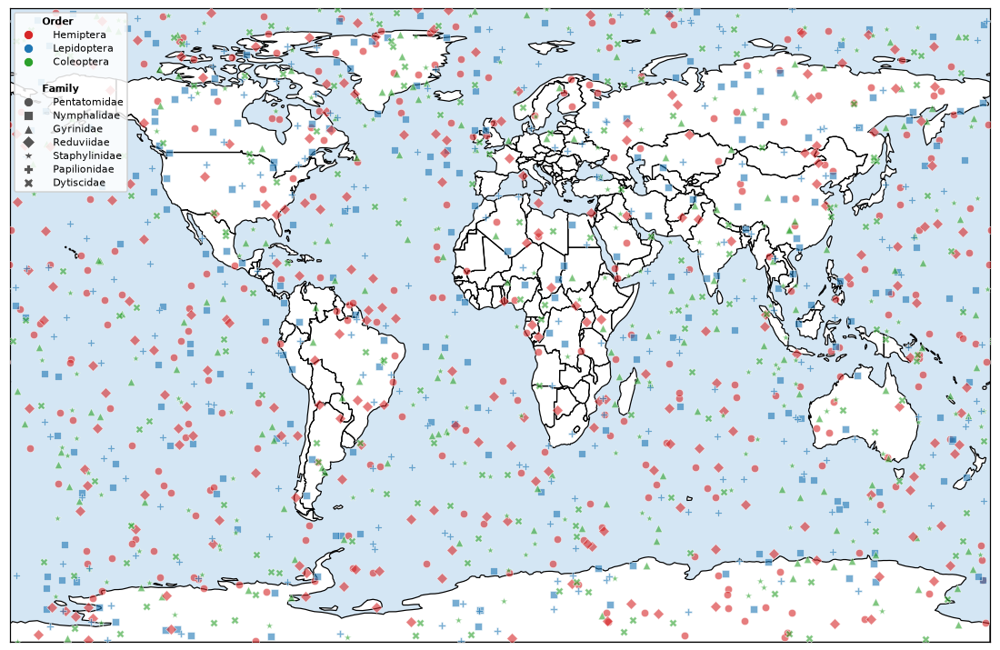

To reproduce these renders: `python scripts/make_screenshots.py`
(writes to `docs/images/`); the app-window screenshots come from
`python scripts/make_app_screenshot.py` (needs a display, or `xvfb-run`).

## Installing

Grab the latest build for your platform from the
[releases page](../../releases). Releases are built automatically whenever a
pull request is merged; each release also carries `PyMappr-<version>-source.zip`
and `PyMappr-<version>-source.tar.gz` archives of the source code.

> You are free to redistribute PyMappr and its source code however you please.
> That said, the [Releases tab](../../releases) of this repository is the only
> official place to download this software - builds obtained anywhere else are
> unofficial and unsupported.

| Platform       | File                                     | Install |
|----------------|------------------------------------------|---------|
| Windows        | `PyMappr-Setup-<version>.exe`             | Run the installer (asks about a desktop shortcut). Re-running it offers to uninstall; there is also a Start-menu *Uninstall PyMappr* shortcut |
| macOS          | `PyMappr-<version>-macOS.dmg`             | Open the DMG and drag PyMappr to Applications |
| Linux (Ubuntu) | `pymappr_<version>_amd64.deb`             | `sudo apt install ./pymappr_<version>_amd64.deb`, then run `pymappr` |
| Linux (Fedora) | `pymappr-<version>-1.<dist>.x86_64.rpm`   | `sudo dnf install ./pymappr-<version>-*.x86_64.rpm`, then run `pymappr` |
| Linux (Arch)   | `pymappr-<version>-1-x86_64.pkg.tar.zst`  | `sudo pacman -U pymappr-<version>-1-x86_64.pkg.tar.zst`, then run `pymappr` |
| Any Linux      | `PyMappr-<version>-linux-<distro>-x86_64.tar.gz` | Extract and run `PyMappr/PyMappr` |

## Running from source

Requires Python 3.11+ with Tk support.

```bash
pip install -r requirements.txt
python scripts/fetch_data.py   # one-time data download (~165 MB core,
                               # + optional biodiversity/ecoregion overlays;
                               # add --skip-extras to fetch only the core)
python -m pymappr
```

## Building the packages

Automated: the
[`build-release.yml`](.github/workflows/build-release.yml) GitHub Actions
workflow builds the Windows installer, the macOS DMG, the Ubuntu `.deb` +
tarball, the Fedora `.rpm` + tarball, and the Arch `pkg.tar.zst` + tarball,
and attaches all of them - plus source `.zip`/`.tar.gz` archives - to a
GitHub release. It runs automatically when a pull request is merged into
`main` (and for `v*` tags or manual dispatch).

Locally:

- **Windows** (needs [Inno Setup 6](https://jrsoftware.org/isinfo.php) with
  `iscc` on PATH): `packaging\build_windows.bat`
- **macOS**: `pyinstaller packaging/pymappr.spec` then create a DMG from
  `dist/PyMappr.app`
- **Linux**: `pyinstaller packaging/pymappr.spec` then
  `packaging/build_linux.sh ubuntu --deb` (Debian/Ubuntu),
  `packaging/build_rpm.sh` (Fedora), or
  `cd packaging/arch && makepkg` (Arch)

## Development

```bash
python -m pytest tests/            # coordinate parser + CSV loader + styling tests
python scripts/render_preview.py   # headless render smoke test -> preview/*.png
python scripts/make_screenshots.py # regenerate the README images
```

Project layout:

- `pymappr/coords.py` - decimal/DMS coordinate parsing
- `pymappr/data_loader.py` - CSV/TSV/Excel reading, column mapping (N name
  columns), and manual coordinate entry parsing
- `pymappr/projects.py` - project files (`.pymappr`), the projects folder,
  settings, and the session autosave
- `pymappr/layers.py` - Natural Earth layer store: lazy loading, the
  110m/50m/10m resolution catalog, derived layers (continents, capitals,
  deserts, wadis, EEZ, bathymetry, ...), and the on-disk frame cache
- `pymappr/projections.py` - map projections (pyproj)
- `pymappr/renderer.py` - matplotlib map rendering (layers, labels, graticule,
  projections, wrap-around panning, zoom-dependent detail, legend, compass)
- `pymappr/styles.py` - point styles, marker symbols, group/color-by styling
- `pymappr/updates.py` - daily update check against the GitHub releases API
- `pymappr/app.py`, `pymappr/ui/` - Tkinter application (tabbed control
  panel, column mapper, manual entry, project manager, legend editor,
  filter bar)
- `scripts/fetch_data.py` - downloads and prepares the bundled map data
- `packaging/` - PyInstaller spec, Inno Setup script, Linux/Fedora/Arch
  packaging

## Support Me

If PyMappr is useful to you, you can support its development on Ko-fi:

[**ko-fi.com/calebhendren**](https://ko-fi.com/calebhendren)

There is also a *Support Me* section in the app's side panel and a
*Support me on Ko-fi* entry in the Help menu.

## Citation

Citing PyMappr is not necessary, but it is welcome. If PyMappr was useful in
your work - a map in a paper, a poster, a blog post, anything - you can
credit it like this:

> Hendren, Caleb. *PyMappr* [computer software].
> https://github.com/CalebHendren/PyMappr

## Data credits

Map data from [Natural Earth](https://www.naturalearthdata.com/) (public
domain): country/state/county boundaries, sovereignty/map unit/subunit
views, disputed areas and boundaries, maritime boundary and 200-nm-limit
indicators, time zones, populated places, urban areas, airports, ports,
US parks & protected lands, lakes, rivers (including intermittent
rivers/wadis), oceans, bathymetry, glaciers, Antarctic ice shelves, reefs,
playas, geographic regions, land polygons, roads, and the Natural Earth I
shaded-relief raster.

Two notes on the marine layers: Natural Earth ships EEZ *indicator lines*
(the "200 mi nl" maritime indicators shown by the *EEZ / 200 nm limits*
toggle), not full EEZ polygons; and the *Wadis* toggle draws Natural
Earth's intermittent rivers, its closest match for wadi/seasonal drainage.

The optional *Biodiversity & ecoregions* overlays come from external, openly
licensed datasets (the same datasets used by
[SimpleMappr](https://github.com/dshorthouse/SimpleMappr), in their
open-licensed forms), fetched by `scripts/fetch_data.py`:

- **Terrestrial ecoregions** - [RESOLVE Ecoregions 2017](https://ecoregions.appspot.com/)
  (Dinerstein et al. 2017), CC-BY 4.0.
- **Biodiversity hotspots** - [Conservation International Biodiversity
  Hotspots](https://zenodo.org/records/3261807) (version 2016.1), CC-BY.
- **Marine ecoregions** - [WWF/TNC Marine Ecoregions of the World
  (MEOW)](https://hub.arcgis.com/datasets/903c3ae05b264c00a3b5e58a4561b7e6),
  CC-BY 4.0.

These are optional: if a download source is unavailable, `fetch_data.py`
skips that layer and the rest of PyMappr works as usual.
