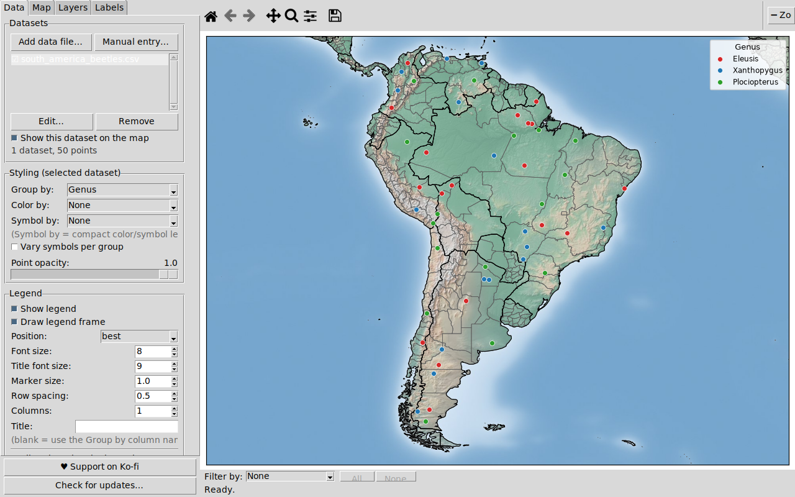
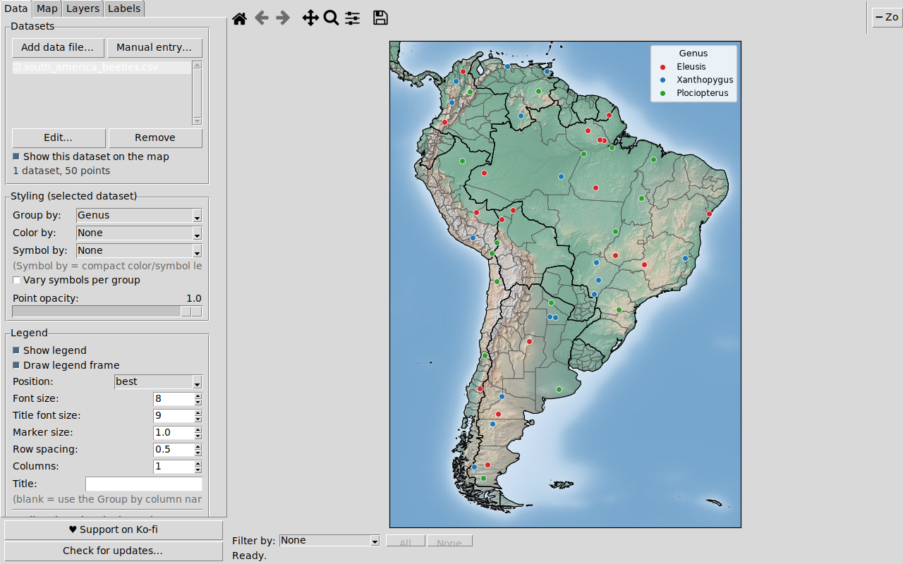
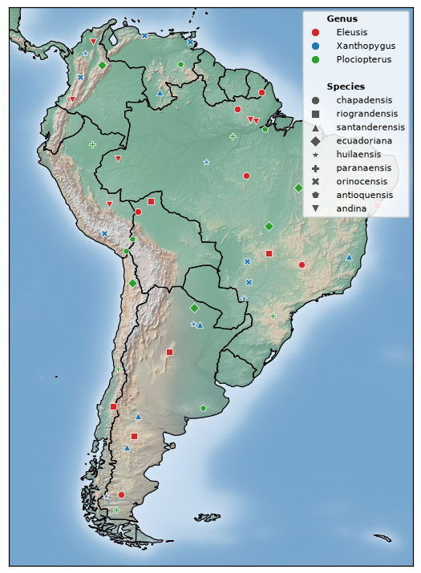
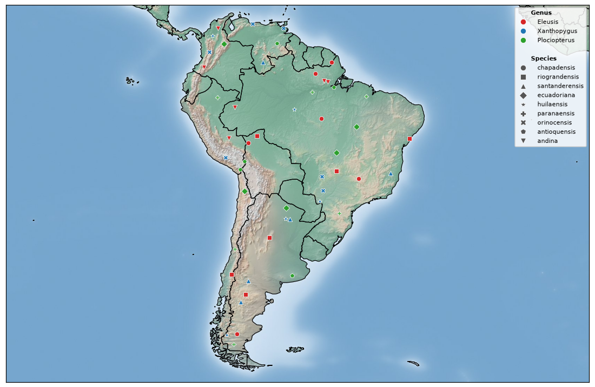
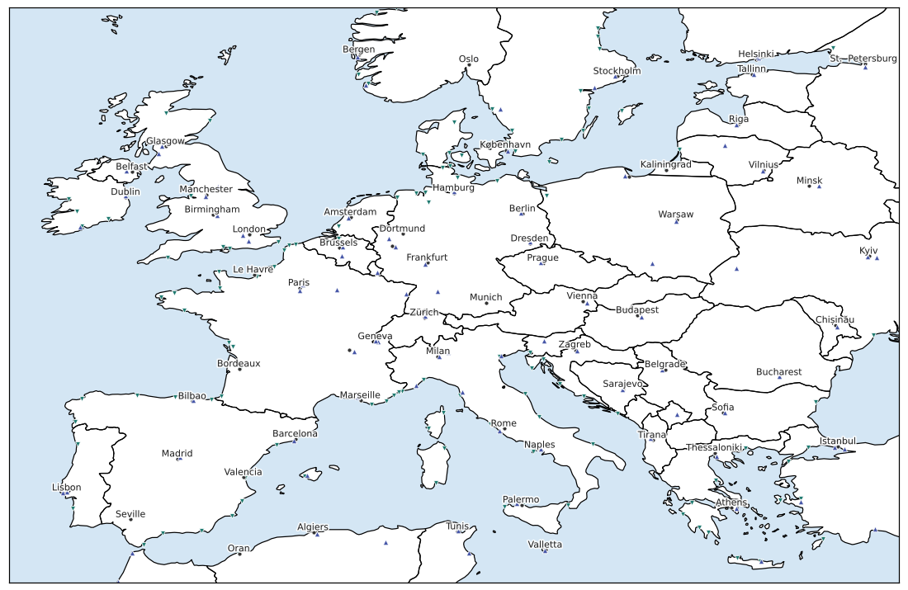
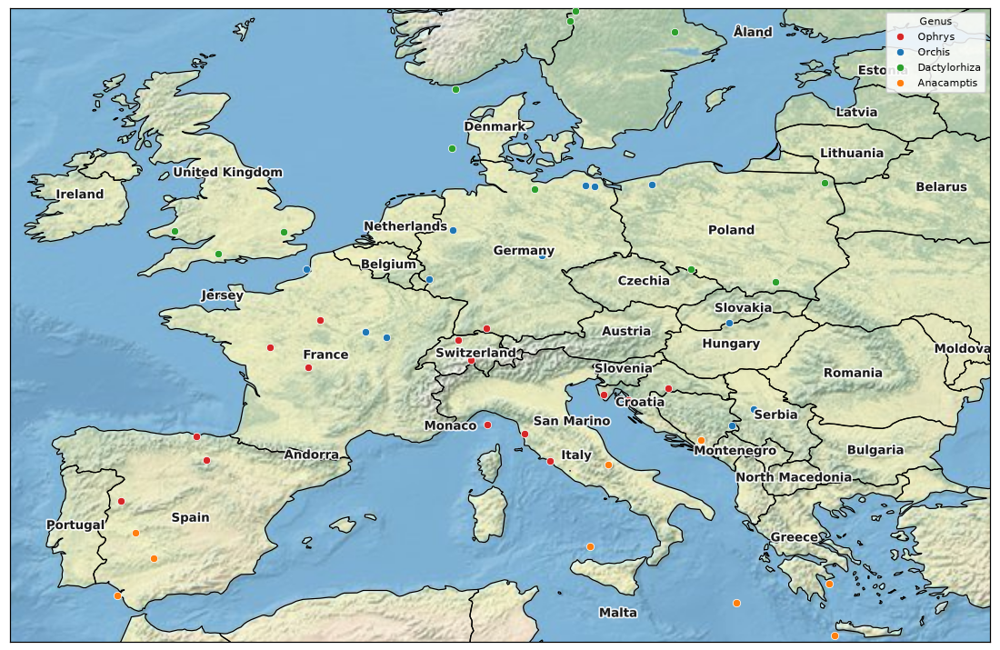

# PyMappr

PyMappr is a remake of [SimpleMappr](https://www.simplemappr.net/) in
Python: the same "CSV of localities in, publication-ready point map out"
workflow, but as an offline desktop application.


[](https://doi.org/10.5281/zenodo.19226226)



## Features

- Load points from CSV/TSV/Excel (with a column-mapping step on import) or
  type them in by hand, decimal degrees or DMS.
- Group/color/symbol styling by any name column, including two-attribute
  styling (e.g. color by Family, symbol by Genus) with a compact legend.
- ~30 toggleable Natural Earth layers (borders, cities, water, physical
  features, infrastructure) with automatic 110m/50m/10m detail by zoom.
- Six map projections plus a Globe (orthographic) view and regional
  Lambert projections, all reprojected live.
- Landscape or portrait framing, draggable legend and labels, compass,
  graticule, and continent presets.
- Projects (`.pymappr` files) with autosave/restore, and export/import for
  sharing.
- Export the current map as PNG, or as a self-contained Python
  (matplotlib) or R (ggplot2) script that reproduces it outside PyMappr.

## Screenshots



| Portrait | Landscape |
|----------|-----------|
|  |  |




More examples, including bathymetry, boundaries, time zones, and basemap
renders, are in [`docs/images/`](docs/images).

## CSV format

Any number of name columns followed by Longitude/Latitude, in any order -
you confirm the mapping on import:

| Genus       | Species       | Longitude   | Latitude    |
|-------------|---------------|-------------|-------------|
| Eleusis     | chapadensis   | -68.4349    | -12.3541    |
| Xanthopygus | orinocensis   | 67°33'37"W  | 10°18'29"N  |

Sample datasets in [`sample_data/`](sample_data) for beetles, seabirds, and
orchids.

## Installing

Grab the latest build for your platform from the
[releases page](../../releases). Releases are built automatically when a
pull request is merged into `main`.

| Platform       | File                                     | Install |
|----------------|------------------------------------------|---------|
| Windows        | `PyMappr-Setup-<version>.exe`             | Run the installer |
| macOS          | `PyMappr-<version>-macOS.dmg`             | Open and drag to Applications |
| Linux (Ubuntu) | `pymappr_<version>_amd64.deb`             | `sudo apt install ./pymappr_<version>_amd64.deb` |
| Linux (Fedora) | `pymappr-<version>-1.<dist>.x86_64.rpm`   | `sudo dnf install ./pymappr-<version>-*.x86_64.rpm` |
| Linux (Arch)   | `pymappr-<version>-1-x86_64.pkg.tar.zst`  | `sudo pacman -U pymappr-<version>-1-x86_64.pkg.tar.zst` |
| Any Linux      | `PyMappr-<version>-linux-<distro>-x86_64.tar.gz` | Extract and run `PyMappr/PyMappr` |

The [Releases tab](../../releases) is the only official download source.

## Running from source

Requires Python 3.11+ with Tk support.

```bash
pip install -r requirements.txt
python scripts/fetch_data.py   # one-time data download (~165 MB core;
                                # add --skip-extras to skip biodiversity/ecoregion overlays)
python -m pymappr
```

## Development

```bash
python -m pytest tests/            # coordinate parser + CSV loader + styling tests
python scripts/render_preview.py   # headless render smoke test -> preview/*.png
python scripts/make_screenshots.py # regenerate the README images
```

Project layout:

- `pymappr/coords.py` - decimal/DMS coordinate parsing
- `pymappr/data_loader.py` - CSV/TSV/Excel reading and column mapping
- `pymappr/projects.py` - project files, settings, session autosave
- `pymappr/layers.py` - Natural Earth layer store and on-disk frame cache
- `pymappr/projections.py` - map projections (pyproj)
- `pymappr/renderer.py` - matplotlib map rendering
- `pymappr/styles.py` - point styles and group/color-by styling
- `pymappr/updates.py` - daily update check against the GitHub releases API
- `pymappr/app.py`, `pymappr/ui/` - Tkinter application
- `scripts/fetch_data.py` - downloads and prepares the bundled map data
- `packaging/` - PyInstaller spec, Inno Setup script, Linux/Fedora/Arch packaging

Building the release packages is automated by
[`build-release.yml`](.github/workflows/build-release.yml); see
`packaging/` for local build scripts per platform.

## Support Me

If PyMappr is useful to you, you can support its development on Ko-fi:
[**ko-fi.com/calebhendren**](https://ko-fi.com/calebhendren)

## Citation

Citing PyMappr is not necessary, but it is welcome:

> Hendren, Caleb. *PyMappr* [computer software].
> https://github.com/CalebHendren/PyMappr
> https://doi.org/10.5281/zenodo.21522496

## Data credits

Map data from [Natural Earth](https://www.naturalearthdata.com/) (public
domain). The optional Biodiversity & ecoregions overlays - Terrestrial
ecoregions ([RESOLVE Ecoregions 2017](https://ecoregions.appspot.com/)),
Biodiversity hotspots ([Conservation International, 2016.1](https://zenodo.org/records/3261807)),
and Marine ecoregions ([WWF/TNC MEOW](https://hub.arcgis.com/datasets/903c3ae05b264c00a3b5e58a4561b7e6)) -
are CC-BY licensed and fetched by `scripts/fetch_data.py`; if a source is
unavailable, that layer is skipped and the rest of PyMappr works as usual.
