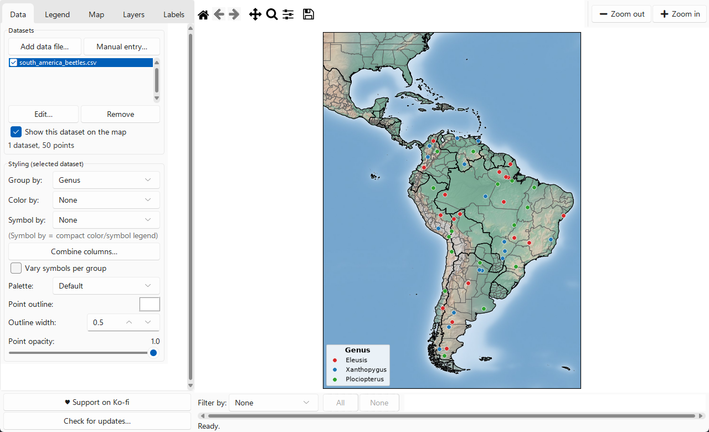
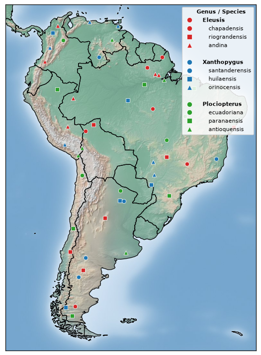
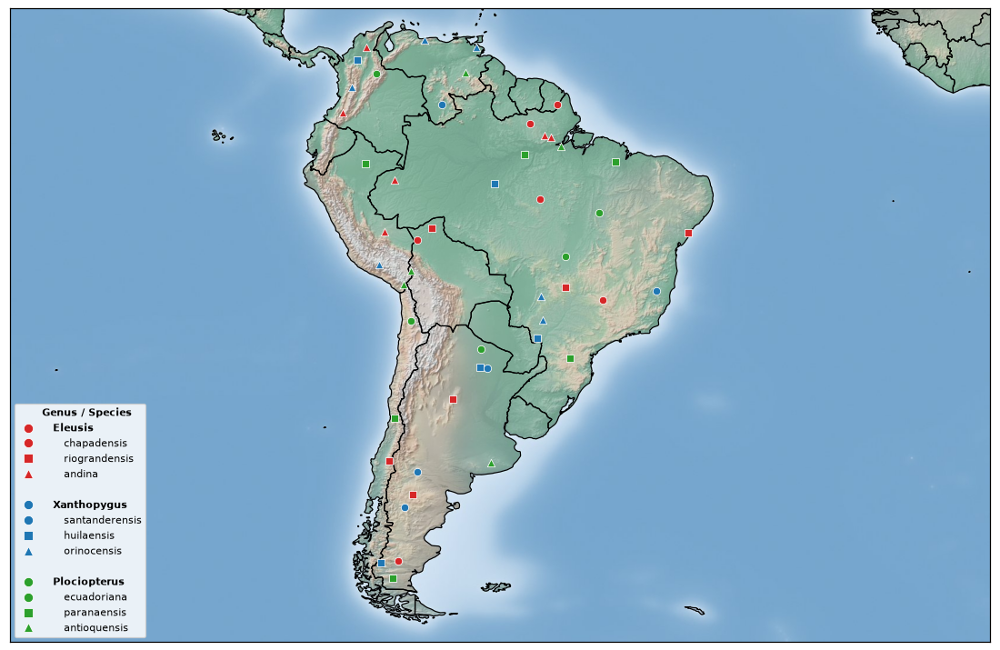
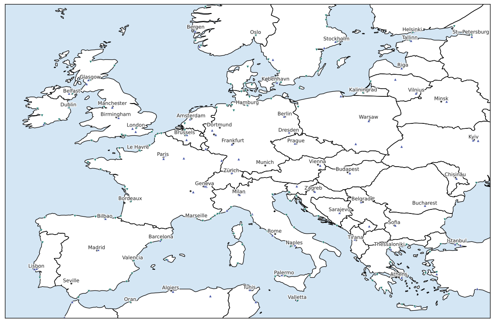
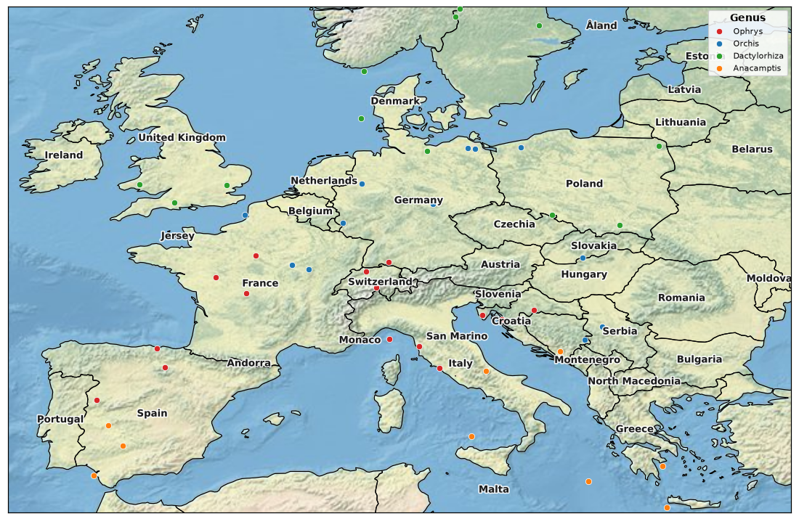

# PyMappr

PyMappr is a remake of [SimpleMappr](https://www.simplemappr.net/) in
Python as an offline desktop application.


[](https://doi.org/10.5281/zenodo.21522496)


## Features

- Load points from CSV/TSV/Excel (with a column-mapping step on import),
  type them in by hand (decimal degrees or DMS), or drop them straight onto
  the map with click-to-place.
- Group/color/symbol styling by any name column, including two-attribute
  styling (e.g. color by Family, symbol by Genus) with a compact legend.
- Legend customization: position, columns, marker scale, spacing, and
  bold / italic / underline for the labels and title. Customize legend
  renames, hides, reorders and restyles individual rows.
- ~30 toggleable Natural Earth layers (borders, cities, water, physical
  features, infrastructure) with automatic 110m/50m/10m detail by zoom.
- Six map projections plus a Globe (orthographic) view and regional
  Lambert projections, all reprojected live. Drag the globe to spin it.
- Landscape or portrait framing, draggable legend and labels, compass,
  graticule, and continent presets.
- A geodesically measured scale bar (kilometres, miles or both) with a
  choice of corner, segmented or plain styling, automatic or fixed length,
  and drag-to-place; the north arrow takes the same placement controls.
- A colourblind-safe (Okabe-Ito) point palette alongside the default, and a
  black & white palette with a settable point outline for black and white
  (outlined) markers.
- Combine name columns (e.g. Genus + Species) into one, so a legend row
  reads "Eleusis chapadensis" without editing the file.
- One-click publication style: black & white outlined markers in varied
  shapes, a plain boxed legend with italic names, and 600 DPI export.
- Projects (`.pymappr` files) with autosave/restore, and export/import for
  sharing.
- Save the map as PNG, JPEG, TIFF, PDF, SVG or WebP at the DPI you choose,
  or export it as a self-contained Python (matplotlib) or R (ggplot2) script
  that reproduces it outside PyMappr. Run the script with `--install-deps`
  to have it install what it needs.

## Publication-ready figures


1. **Data tab > Combine columns...** joins Genus and Species into one name
   column and groups by it, so each legend line reads *Eleusis chapadensis*.
   The source file is left as it is.
2. **Map tab > Apply publication style** switches to black & white points
   with black outlines and varied shapes, a plain boxed legend with italic
   names, and 600 DPI export. Rows you restyled with Customize legend keep
   their styling.
3. **File > Save map as...** and pick TIFF or PDF.

## Screenshots




| Portrait | Landscape |
|----------|-----------|
|  |  |




More examples, including bathymetry, boundaries, time zones, and basemap
renders, are in [`docs/images/`](docs/images).

## CSV format

Any number of name columns followed by Longitude/Latitude, in any order -
you confirm the mapping on import:

| Genus       | Species       | Longitude   | Latitude    |
|-------------|---------------|-------------|-------------|
| Eleusis     | chapadensis   | -68.4349    | -12.3541    |
| Xanthopygus | orinocensis   | 67°33'37"W  | 10°18'29"N  |

With Genus and Species in separate columns like this, **Combine columns...**
on the Data tab puts both on one legend line without editing the file:


Sample datasets in [`sample_data/`](sample_data) for beetles, seabirds, and
orchids.

## Installing

Grab the latest build for your platform from the
[releases page](../../releases). Releases are built automatically when a
pull request is merged into `main`.

| Platform       | File                                     | Install |
|----------------|------------------------------------------|---------|
| Windows        | `PyMappr-Setup-<version>.exe`             | Run the installer |
| macOS          | `PyMappr-<version>-macOS.dmg`             | Open and drag to Applications |
| Linux (Ubuntu) | `pymappr_<version>_amd64.deb`             | `sudo apt install ./pymappr_<version>_amd64.deb` |
| Linux (Fedora) | `pymappr-<version>-1.<dist>.x86_64.rpm`   | `sudo dnf install ./pymappr-<version>-*.x86_64.rpm` |
| Linux (Arch)   | `pymappr-<version>-1-x86_64.pkg.tar.zst`  | `sudo pacman -U pymappr-<version>-1-x86_64.pkg.tar.zst` |
| Any Linux      | `PyMappr-<version>-linux-<distro>-x86_64.tar.gz` | Extract and run `PyMappr/PyMappr` |

The [Releases tab](../../releases) is the only official download source.

## Running from source

Requires Python 3.11+ with Tk support.

```bash
pip install -r requirements.txt
python scripts/fetch_data.py   # one-time data download (~165 MB core;
                                # add --skip-extras to skip biodiversity/ecoregion overlays)
python -m pymappr
```

## Development

```bash
python -m pytest tests/            # the test suite (a few tests need the map data)
python scripts/make_screenshots.py # regenerate the README map images
python scripts/make_screenshots.py --out preview --all  # render check, more layers
python scripts/make_app_screenshot.py  # the app screenshots (needs a display)
```

Project layout:

- `pymappr/coords.py` - decimal/DMS coordinate parsing
- `pymappr/data_loader.py` - CSV/TSV/Excel reading and column mapping
- `pymappr/projects.py` - project files, settings, session autosave
- `pymappr/layers.py` - Natural Earth layer store and on-disk frame cache
- `pymappr/projections.py` - map projections (pyproj)
- `pymappr/renderer/` - matplotlib map rendering, one module per concern
  (view, layers, overlays, labels, points and legend, mouse), plus the
  layer style tables shared with code export
- `pymappr/styles.py` - point styles and group/color-by styling
- `pymappr/legend.py` - legend options and legend rows
- `pymappr/layout.py` - what every dataset draws (shared by the app and code
  export)
- `pymappr/codegen.py`, `pymappr/templates/` - Python/R code export
- `pymappr/updates.py` - daily update check against the GitHub releases API
- `pymappr/app.py`, `pymappr/ui/` - Tkinter application
- `scripts/fetch_data.py` - downloads and prepares the bundled map data
- `packaging/` - PyInstaller spec, Inno Setup script, Linux/Fedora/Arch packaging

Building the release packages is automated by
[`build-release.yml`](.github/workflows/build-release.yml); see
`packaging/` for local build scripts per platform.

## MiniMappr (browser version)

[`index.html`](index.html) is **MiniMappr**, a browser-only edition
of PyMappr hosted with GitHub Pages at
[calebhendren.github.io/PyMappr](https://calebhendren.github.io/PyMappr/). It
covers the core workflow with no install: points from a CSV/TSV (with a
column-mapping step), a pasted table, or manual entry, decimal degrees or DMS,
styled by group/color/symbol on the same projections (Equirectangular, Mercator,
Robinson, Mollweide, Natural Earth, Winkel Tripel, orthographic Globe, and
regional Lambert), exported as PNG or SVG.

It intentionally leaves out the heavier desktop features: the ~30 Natural Earth
layers, relief/Blue Marble basemaps, bathymetry, labels, Excel import, project
files, and Python/R code export. The page is self-contained (D3,
d3-geo-projection, topojson-client, and a simplified world outline are all
inlined) and is kept out of the PyInstaller build.

## Support Me

If PyMappr is useful to you, you can support its development on Ko-fi:
[**ko-fi.com/calebhendren**](https://ko-fi.com/calebhendren)

## Citation

Citing PyMappr is not necessary, but it is welcome:

> Hendren, Caleb. *PyMappr* [computer software].
> https://github.com/CalebHendren/PyMappr
> https://doi.org/10.5281/zenodo.21522496

## Data credits

Map data from [Natural Earth](https://www.naturalearthdata.com/) (public
domain). The optional Biodiversity & ecoregions overlays - Terrestrial
ecoregions ([RESOLVE Ecoregions 2017](https://ecoregions.appspot.com/)),
Biodiversity hotspots ([Conservation International, 2016.1](https://zenodo.org/records/3261807)),
and Marine ecoregions ([WWF/TNC MEOW](https://hub.arcgis.com/datasets/903c3ae05b264c00a3b5e58a4561b7e6)) -
are CC-BY licensed and fetched by `scripts/fetch_data.py`; if a source is
unavailable, that layer is skipped and the rest of PyMappr works as usual.

MiniMappr (the browser version) uses a simplified, Natural Earth-derived world
outline from [world-atlas](https://github.com/topojson/world-atlas) (public
domain), rendered with [D3](https://d3js.org) and d3-geo-projection and decoded
with topojson-client (all ISC licensed).
